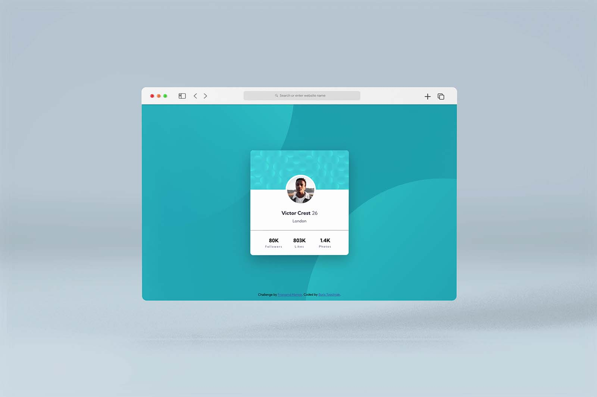

## Frontend Mentor - Profile Card Component Challenge
This is a another solution to the [Profile card component challenge on Frontend Mentor](https://www.frontendmentor.io/challenges/profile-card-component-cfArpWshJ). Frontend Mentor challenges help you improve your coding skills by building realistic projects.

### The challenge
Challenge is to build out this profile card component and get it looking as close to the design as possible. I've wanted to make it more challenging and decided not to use Grid and/or Flexbox.

### Built Using
- [x] HTML
- [x] CSS

### Solution Preview

### Links
- Live Site URL: [Live Solution Preview](https://btopolnjak.github.io/fm-profile-card-component/)
- Website - [Boris Topolnjak](https://github.com/btopolnjak)
- Frontend Mentor - [@btopolnjak](https://www.frontendmentor.io/profile/btopolnjak)
- LinkedIn - [@boris-topolnjak](https://www.linkedin.com/in/boris-topolnjak-23334b104/)